# Manual testing

The manual test I completed are detailed below. The tests were designed to ensure that Lifesort was working as intended at time of deployment. The intention of the tests was to ensure the site was interacting with the back end API correctly and also giving error feedback to the user where appropriate.

## Navbar

- [x] User can interact with navbar.

- [x] Navbar is fully responsive.

- [x] Navbar appears differently depending on the logged in status of the user.

- [x] Navbar has a dropdown menu to create tasks.

- [x] For smaller screen sizes navbar has a hamburger menu.

## Landing page

- [x] Landing page is fully responsive.

- [x] Landing page reflects logged in status of user.

- [x] All links are working correctly.

## Footer

- [x] Footer is fully responsive.

- [x] Social links in footer open in a new tab.

- [x] Footer stays at bottom of screen on all pages in site.

## Sign up page

- [x] Sign up page is fully responsive.

- [x] Errors are shown if form not filled out correctly.

- [x] When a user signs up is re directed to login screen.

- [x] All links work correctly.

- [x] If a user is logged in gets redirected when trying to access page.

## Log in page

- [x] Log in page is fully responsive.

- [x] Errors are shown to user if form not filled out correctly.

- [x] If a user is logged in gets redirected when trying to access page.

- [x] when a user gets logged in they are taken to the landing page.

## Dashboard

- [x] Loading spinner is shown to user when first accessing page to indicate tasks are loading.

- [x] On smaller devices buttons appear with links to the task lists.

- [x] All links work as expected.

- [x] Infinite scroll is working for all task categories.

- [x] Edit and delete buttons are working as expected.

## Custom task list page

- [x] Page is fully responsive

- [x] Edit and delete buttons are working as expected.

- [x] Infinite scroll is working as expected.

- [x] If a task is set as completed by user it is not shown in list.

## Quick task list page

- [x] Page is fully responsive

- [x] Edit and delete buttons are working as expected.

- [x] Infinite scroll is working as expected.

- [x] If a task is set as completed by user it is not shown in list.

## Holiday task list page

- [x] Page is fully responsive

- [x] Edit and delete buttons are working as expected.

- [x] Infinite scroll is working as expected.

- [x] If a task is set as completed by user it is not shown in list.

## Custom task detail page

- [x] Page is fully responsive

- [x] Edit and delete buttons are working as expected.

- [x] User is given feedback on if a task is overdue or on schedule.

- [x] User can clearly see details of task.

## Holiday task detail page

- [x] Page is fully responsive

- [x] Edit and delete buttons are working as expected.

- [x] User is given feedback on if a task is overdue or on schedule.

- [x] User can clearly see details of task.

## Quick task detail page

- [x] Page is fully responsive

- [x] Edit and delete buttons are working as expected.

- [x] User is given feedback on if a task is overdue or on schedule.

- [x] User can clearly see details of task.

## Create a custom task page

- [x] Page is fully responsive.

- [x] Error feedback is given to user.

- [x] Due date cannot be set before start date.

- [x] Entered data into form is stored correctly.

- [x] Form is working as expected.

## Create a holiday task page

- [x] Page is fully responsive.

- [x] Error feedback is given to user.

- [x] Entered data into form is stored correctly.

- [x] Form is working as expected.

## Create a quick task page

- [x] Page is fully responsive.

- [x] Error feedback is given to user.

- [x] Entered data into form is stored correctly.

- [x] Form is working as expected.

## Edit custom task

- [x] page is fully responsive.

- [x] Error feedback is given to user.

- [x] Changes made in the form are reflected straight away to user.

- [x] Links on page are working as intended.

- [x] When a user saves the changes they are shown the task on it's task detail page.

## Edit holiday task

- [x] page is fully responsive.

- [x] Error feedback is given to user.

- [x] Changes made in the form are reflected straight away to user.

- [x] Links on page are working as intended.

- [x] When a user saves the changes they are shown the task on it's task detail page.

## Edit quick task

- [x] page is fully responsive.

- [x] Error feedback is given to user.

- [x] Changes made in the form are reflected straight away to user.

- [x] Links on page are working as intended.

- [x] When a user saves the changes they are shown the task on it's task detail page.

## Delete custom task

- [x] When the delete button is clicked a modal appears to confirm deletion

## Profile page

- [x] Page is fully responsive.

- [x] All links work correctly.

- [x] Profile image is shown to user.

- [x] User can change password and user name.

- [x] User can edit bio and change profile image.

- [x] Current username is shown to user below profile image.

## 404 page

- [x] If a user attempts to access a wrong url on site they are shown a 404 page.

- [x] Page is fully responsive.

## Back to top button

- [x] Appears when the screen has been scrolled down and not visible all the time.

- [x] Performs a smooth scroll to top of page when clicked.

## ESLint

ESLint was used to check the validity of the JSX code and it shows no errors at the time of deployment.

Image below shows command executed to run eslint no errors shown in terminal after command had ran.

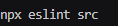

## CSS

I used the [Jigsaw](https://jigsaw.w3.org/css-validator/) CSS validator to validate all CSS code with no errors showing.

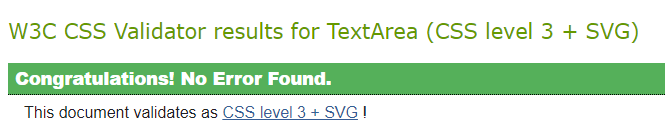

## Lighthouse 

Lighthouse check were also carried out with a 100 rating for accessibility on all pages within the site and high best practices scores as well. The performance score does vary depending on what page you are on I minimised the images as much as I could to decrease loading times and to increase the score as much as I could.

404 page:

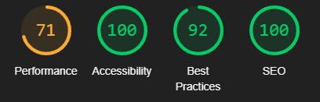

Create custom task page:

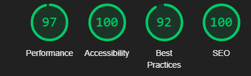

Create holiday task page:

Create quick task page:

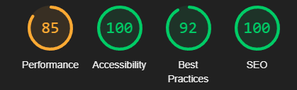

Custom task detail score:

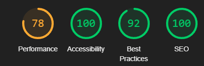

Custom tasks page score:

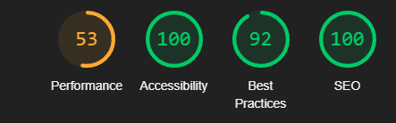

Dashboard score:

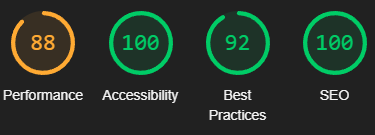

Holiday task detail score:

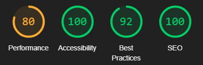

Holiday tasks page score:

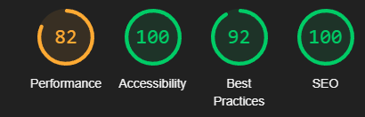

landing page score:

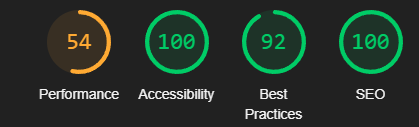

Login page score:

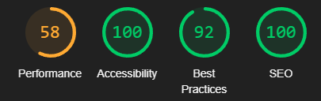

Profile page score:

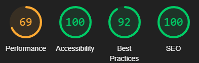

Quick task detail score:

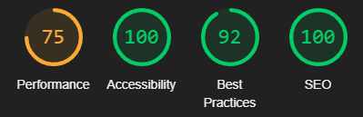

Quick tasks page score:

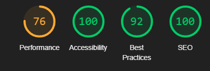

Sign up page score:

## WAVE

I have also used [WAVE](https://wave.webaim.org/). On each page within the site with no errors showing on the feedback form.