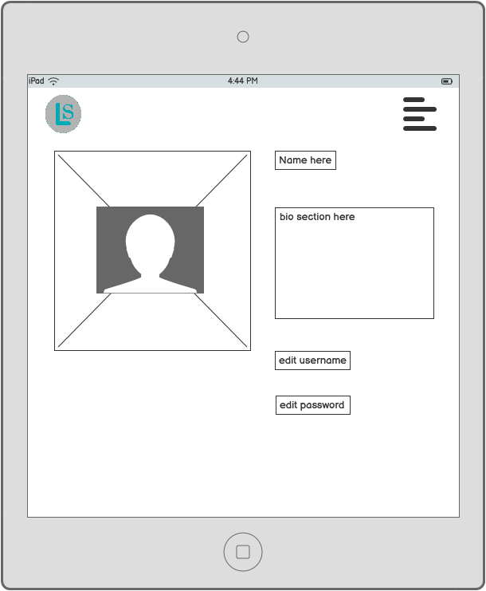

# Lifesort

Lifesort is a task management application, it allows users of the site to sign up and login with their own profile. From there they are able to create tasks: A detailed custom task, a lesser detailed quick task and also holiday tasks.

The custom task option allows the user to create a more detailed task with the ability to create a title, description, set a due date, set a start date among other options as well. The aim for the custom task option is to be able to set a task or an event that would require extra detail such as setting up an event for an annual meeting.

The quick task option allows users to create a less detailed task with the ability to create a title, description, priority, due date, and current status of task. The aim for the quick task option is allow users to create a list of normal everyday tasks that would need completing such as mowing the grass.

The holiday task option allows users to create a detailed task list focused on what would be required for a holiday. The aim for the holiday task option is to allow users of the site to organise themselves for a future trip away.

Users of the site have full CRUD control over their own tasks with the ability to see their tasks all at once if they are using a desktop computer or in separate lists they can click on a task to see a single task. The user has access to the edit function and delete function throughout these pages. If a user is on a smaller device they have access to all of the tasks created but due to the application having infinite scroll the access is separated out to each individual list of tasks created.

Users of the site also have access to their own profile page and have the ability to edit their profile and update their profile image which is displayed in the navigation bar of the application.

Lifesort was designed with the focus on an application that can be used on desktop computers but also on mobile devices as well.

Due to the nature of the application I designed it so the profile and task owner has access only to their own data.

Lifesort has a separate front-end built with React and a back-end built with the Django-Rest-Framework. Both of the front-end and back-end have been deployed on [Heroku](https://www.heroku.com/)

This ReadMe is for the front end section of the application.

### Deployed front-end site [Lifesort front-end live site](https://life-sort.herokuapp.com/)
### Deployed back-end API [Lifesort back-end API live site](https://life-sort-api.herokuapp.com/)

### Back-end repository [Lifesort back-end repository](https://github.com/carl2087/life-sort-drf-api)

## Project Goals

 * To create a task application where users can create tasks that vary in detail.
 * For users of the site to have full CRUD functionality within the tasks that they create.
 * Deliver a simple and intuitave user experience suitable for a wide range of users.
 * Offer a minimal set of features chosen in order to deliver a useful application within an achievable development timeframe, whilst laying a solid foundation to add additional features in the future.

## Planning

Planning for the application was based on an agile methodology utilising GitHubs issues and projects tabs to create user stories for the site. There are user stories which are for the project goals of the site and what I wanted to achieve and I set up project tasks as well which incorporate the what is required for each step of the project.

The user stories were then worked on in iterations which lasted a week each when each story was started then completed it was moved through the KanBan board into the relevant section.

I also added labels to the user stories consisiting of must-have, should-have and could-have to ensure that the features that had to be included to achieve the project goals were included.

I also added a column for bugs that arose during the making of the application which were documented and the de bugging steps were included also.

[Lifesort Kanban board](https://github.com/users/carl2087/projects/10)

[Lifesort project tasks](https://github.com/users/carl2087/projects/11)

[Lifesort user stories](https://github.com/carl2087/life-sort-task-app/issues)

### Design

To decide on the design for the application I started off with wireframes to decide on the general layout of the site to make the wirframes I used [Balsamiq](https://balsamiq.com/wireframes/?gad=1&gclid=Cj0KCQjw756lBhDMARIsAEI0AgkX-3sNRNBsbey5CZvrpsmGPA9oSAXJD_pzaX52fTg1wCV-R2MGPe0aAqU5EALw_wcB). I then utilised [colorhunt](https://colorhunt.co/) to help choose a colour theme. To help speed up building the site I used [React Bootstrap](https://react-bootstrap.netlify.app/). This helped ensure I kept to a mobile first design and help design an application to be used on all devices.

#### Wireframes

The wireframes for the site are pictured below.

##### Landing page

When first visiting the site I wanted users to arrive at a landing page with the options to login or sign up if not already. If the user is logged in then be shown links to their dashboard.

Logged out desktop:

Logged in desktop:

Logged out tablet:

Logged in tablet:

Logged out mobile:

Logged in mobile:

##### Dashboard

For the dashboard I wanted this to be where a user of the site could view all of their tasks on one page and have infinite scroll so all the tasks keep loading. For smaller devices I changed the view to show buttons instead to links to each tasks list page as to avoid a super long list with different tasks on it.

Dashboard desktop:

Dashboard tablet:

Dashboard mobile:

##### Individual task page

When clicking on a title of a task you are taken to the invidual task page for that particular task.

Individual task page desktop:

Individual task page tablet:

Individual task page mobile:

##### Create a task and edit a task

The layout for creating a task and editing a task is the same so they have one wireframe for both.

Desktop:

Tablet:

Mobile:

##### Profile page

I wanted users of the site to have access to their own profile page within the site so they can update profile image and bio and have access to their tasks from here as well.

Profile page desktop:

Profile page tablet:

Profile page mobile:

##### Sign up and login pages

The sign up and log in pages are the same design as well so they are shown below.

Desktop:

Tablet:

Mobile:

